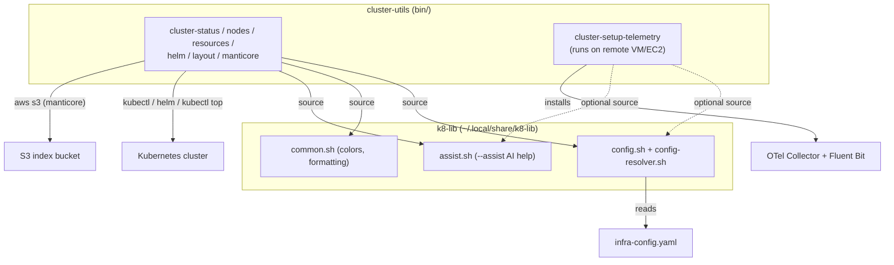

# cluster-utils — Architecture

## Overview

`cluster-utils` is a terminal utility package of standalone Bash dashboards for inspecting
Kubernetes clusters (`cluster-*` commands). Each tool queries the cluster via `kubectl`,
`helm`, and `metrics-server` against the current kubectl context and renders a color-coded
terminal dashboard. There is no in-repo library: all shared logic (colors, formatting,
config resolution, AI-assist) comes from the repo-level **k8-lib** shell library, sourced
at runtime from `~/.local/share/k8-lib` (overridable via `K8_LIB_DIR`).

Within the wider Noizu utilities ecosystem, this package follows the standard conventions:
tools install flat into `~/.local/bin` (locally via `make install`, or with everything else
via the monorepo's `make install-utilities`, which also installs k8-lib), and cluster-aware
behavior (tier groupings, status patterns, telemetry settings) is driven by the repo-root
`infra-config.yaml` resolved through k8-lib's `config-resolver.sh`.

## System Diagram

## Core Components

| Component | Purpose |
|-----------|---------|
| `bin/cluster-status` | Tiered pod dashboard grouped by category; `--watch` auto-refresh |
| `bin/cluster-nodes` | Node layout: capacity type, CPU/RAM reservations; `--pods` placement |
| `bin/cluster-resources` | Per-pod CPU/RAM usage vs requests (requires metrics-server) |
| `bin/cluster-helm` | Helm release listing with failure highlighting |
| `bin/cluster-layout` | Node/pod/PVC/PV layout as markdown, rendered via `glow` |
| `bin/cluster-manticore` | Manticore Search dashboard: readers, index versions, S3 state, jobs |
| `bin/cluster-setup-telemetry` | Installs OTel Collector + Fluent Bit on a VM/EC2 (run on target host, needs root) |
| `Makefile` | `make install` copies `bin/cluster-*` to `INSTALL_DIR` (default `~/.local/bin`) |

## Shared Library (k8-lib)

Every dashboard sources three k8-lib modules from `$K8_LIB_DIR` (default
`~/.local/share/k8-lib`): `config.sh` (settings from `infra-config.yaml` via
`config-resolver.sh`), `common.sh` (color constants, status symbols, formatting), and
`assist.sh` (adds `--assist "question"` AI help to every tool). Tools pre-parse `--config
<path>` into `K8_CONFIG` before sourcing so an alternate config file takes effect during
library init. `cluster-setup-telemetry` treats k8-lib as optional and falls back to
defaults so it can run on remote VMs without the library installed.

→ *See [arch/shared-library.md](arch/shared-library.md) for details*

## Installation

`make install` globs `bin/cluster-*` and copies each to `INSTALL_DIR` (default
`~/.local/bin`) with mode 755. k8-lib is installed separately by the parent monorepo's
`make install-utilities`; the scripts locate it by absolute path, not relative to
themselves, so the copies work from anywhere.

→ *See [arch/installation.md](arch/installation.md) for details*

## Key Decisions

- **Standalone Bash scripts** — no compiled dependencies; runs anywhere `bash` + `kubectl` exist
- **Runtime-sourced shared library** — k8-lib lives outside this package (`~/.local/share/k8-lib`), avoiding duplication across all Noizu k8 utilities and keeping installed copies path-independent
- **`--config` pre-parse** — config path must resolve before k8-lib sourcing, so it is parsed ahead of normal arg handling
- **Optional k8-lib for telemetry setup** — `cluster-setup-telemetry` runs on remote hosts where k8-lib may not exist; everything is overridable via `K8_TELEMETRY_*` env vars
- **Markdown output for layout** — `cluster-layout` emits markdown pipeable to `glow` or saveable as documentation
- **Color-coded status everywhere** — red/yellow/green ANSI coloring surfaces problems at a glance
