# cluster-utils — Architecture

## Overview

`cluster-utils` is a pure-Bash utility package of seven `cluster-*` commands for
Kubernetes inspection and host telemetry bootstrap. Six tools are read-only terminal
dashboards against the **current kubectl context**; the seventh
(`cluster-setup-telemetry`) is a root-level installer that runs **on a remote VM/EC2**.

There is **no in-repo library**. Shared config, colors, and `--assist` AI help come
from the monorepo **k8-lib** package, sourced at runtime from
`${K8_LIB_DIR:-$HOME/.local/share/k8-lib}`. Optional cluster-aware settings
(status pod-name patterns, Manticore labels/S3 bucket, `telemetry:` block) load from
`infra-config.yaml` via k8-lib’s `config-resolver.sh`. Built-in defaults apply when
config is missing.

Package location (dual path in monorepo):
`Portfolio/Utilities/source/cluster-utils` ↔ `utilities/k8/cluster-utils`.

## System Diagram

```mermaid
graph TB
    subgraph "cluster-utils bin/"
        ST[cluster-status]
        ND[cluster-nodes]
        RS[cluster-resources]
        HM[cluster-helm]
        LY[cluster-layout]
        MC[cluster-manticore]
        TEL[cluster-setup-telemetry]
    end

    subgraph "k8-lib ~/.local/share/k8-lib"
        CFG["config.sh + config-resolver.sh"]
        COM["common.sh"]
        AST["assist.sh"]
    end

    ST & ND & RS & HM & MC -->|required source| CFG & COM & AST
    LY -.->|optional assist.sh only| AST
    TEL -.->|optional config + assist| CFG & AST
    CFG -->|reads| YAML["infra-config.yaml"]

    ST & ND & RS & HM & LY & MC -->|kubectl| K8S[Kubernetes API]
    RS -->|kubectl top| MS[metrics-server]
    HM -->|helm list -o json| HELM[Helm]
    HM & LY -->|python3 JSON| PY[Python 3]
    MC -->|aws s3| S3[S3 index bucket]
    MC -->|kubectl exec| READER[manticore-reader pods]
    TEL -->|install + configure| OTEL["signoz-otel-collector + Fluent Bit"]
```

## Core Components

| Component | Role | Notable flags / deps |
|-----------|------|----------------------|
| `bin/cluster-status` | Pod dashboard: sections by **name-pattern category** (Databases, Search, Applications, Networking, Infrastructure, Jobs); shows ready/status/capacity-type/node | `--watch` (5s refresh); patterns via `K8_STATUS_*_PATTERN` |
| `bin/cluster-nodes` | Per-node table: instance type, Karpenter capacity (spot/on-demand), zone, manager (`karpenter:pool` / `eks:group`), CPU & MEM req/lim/alloc, pod count | `--pods` lists pods per node |
| `bin/cluster-resources` | Join `kubectl top pods` usage with pod request specs; flags `OVER-CPU` / `OVER-MEM` | `-n <ns>`; **requires metrics-server** |
| `bin/cluster-helm` | Helm releases (JSON via python3) color-coded by status; plus **Database Pods** and **Database PVCs** sections for timescale/postgres/manticore | `-n <ns>`; needs `helm` + `python3` |
| `bin/cluster-layout` | Markdown snapshot: pods by namespace with pool/capacity, node summary, PVC→PV map, per-node volumes (EBS/local/EFS via python3) | Optional `assist.sh` only; **does not** source config/common; `glow` is optional for viewing |
| `bin/cluster-manticore` | Manticore Search: reader pods, main/delta index versions + doc counts (`kubectl exec`), S3 latest versions/sizes (`aws s3`), indexer jobs + delta CronJob schedule | Namespace/labels/S3 via `K8_NAMESPACE`, `K8_MANTICORE_*` |
| `bin/cluster-setup-telemetry` | On target host (root): install **signoz-otel-collector** + **Fluent Bit**, detect PG/MySQL/Nginx/Redis/Docker, write configs to central OTLP endpoint | Positional: `<endpoint:port> [hostname]`; k8-lib optional; `K8_TELEMETRY_*`, `FORCE_REINSTALL=1` |
| `Makefile` | `compile`/`test` no-ops; `install` copies `bin/cluster-*` → `INSTALL_DIR` (default `~/.local/bin`, mode 755) | |

## Runtime flow (dashboards)

Typical path for status/nodes/resources/helm/manticore:

1. Pre-parse `--config` / `--config=<path>` → export `K8_CONFIG` **before** library source
2. `source` `$K8_LIB_DIR/bin/{config,common,assist}.sh` then `_k8_check_assist`
3. Query live cluster (`kubectl`, optionally `helm` / `aws` / `python3`)
4. Render ANSI-colored tables to stdout (or markdown for layout)

`cluster-layout` skips config/common and only optionally loads assist.  
`cluster-setup-telemetry` optionally loads config+assist; uses `_telem_cfg` with hardcoded defaults when k8-lib is absent.

## Shared library (k8-lib)

| Module | Used by | Provides |
|--------|---------|----------|
| `config.sh` | Most tools; optional on telemetry | Values from `infra-config.yaml` / env (`K8_*`) |
| `common.sh` | Dashboards except layout | Color constants, status symbols, formatting helpers |
| `assist.sh` | All (layout/telemetry optional) | `--assist "question"` via `_k8_check_assist` |

Config precedence: CLI `--config` → `K8_CONFIG` env → resolver default discovery → per-key env overrides.

→ Details: [arch/shared-library.md](arch/shared-library.md)

## Installation

`make install` globs `bin/cluster-*` into `INSTALL_DIR` (`~/.local/bin` by default).
k8-lib is **not** shipped here; monorepo `make install-utilities` installs both.
Scripts use absolute `$K8_LIB_DIR`, so installed copies are path-independent.

→ Details: [arch/installation.md](arch/installation.md)

## Key Decisions

| Decision | Rationale |
|----------|-----------|
| Standalone Bash, no compile step | Runs wherever `bash` + kubectl exist; Makefile `compile`/`test` are placeholders |
| Shared library outside package | One k8-lib for all Noizu k8 utilities; install copies need no relative `share/` tree |
| `--config` pre-parse | Library init reads config at source time; path must be set first |
| Pattern sections (not deploy tiers) in status | Categories are regexes over pod names (`K8_STATUS_*_PATTERN`), overridable without code change |
| Layout emits markdown only | Pipe to `glow` or save for docs; no hard dependency on a renderer |
| Telemetry tool optional k8-lib | Must run on bare VMs; defaults + `K8_TELEMETRY_*` / monitor creds suffice |
| Inline python3 for JSON | Helm list, multi-field PV walks, PVC filters — awk alone is brittle |
| Karpenter-aware labels | Nodes/status/layout read `karpenter.sh/capacity-type`, `nodepool`, with lifecycle fallback |

## Tech Stack

| Layer | Choice |
|-------|--------|
| Language | Bash (`#!/usr/bin/env bash`, `set -euo pipefail`) |
| Orchestration API | `kubectl` (current context) |
| Helm | `helm list --output json` (`cluster-helm`) |
| Metrics | metrics-server via `kubectl top pods` (`cluster-resources`) |
| JSON helpers | `python3` (helm, layout volumes, helm DB sections) |
| Cloud | AWS CLI `aws s3` (`cluster-manticore`) |
| Shared lib | k8-lib shell modules (`config`, `common`, `assist`) |
| Config | `infra-config.yaml` / `.infra-config.yaml` (via k8-lib); env overrides |
| Telemetry install | signoz-otel-collector (GitHub release tarball), Fluent Bit (vendor install), systemd, `curl`/`nc` |
| Optional UX | `glow` for markdown viewing; Claude via assist.sh |
| Install | `make` + `install -m 755` |

## External runtime prerequisites

| Tool / service | Required by |
|----------------|-------------|
| `kubectl` + cluster access | All dashboards |
| `helm` | `cluster-helm` |
| metrics-server | `cluster-resources` |
| `python3` | `cluster-helm`, `cluster-layout` (volume section) |
| `aws` CLI + S3 access | Full `cluster-manticore` S3 section |
| `glow` | Optional viewer for `cluster-layout` output |
| root/sudo, network to OTLP | `cluster-setup-telemetry` on target host |
| k8-lib on `K8_LIB_DIR` | Required for five dashboards; optional for layout assist + telemetry |

## Related docs

- Layout tree: [PROJ-LAYOUT.md](PROJ-LAYOUT.md)
- Config/env artifacts: [PROJ-SCHEMA.md](PROJ-SCHEMA.md) (no persistence layer)
- Tasks: [PROJ-HOWTO.md](PROJ-HOWTO.md)
- Telemetry walkthrough: [howto/setup-telemetry.md](howto/setup-telemetry.md)
